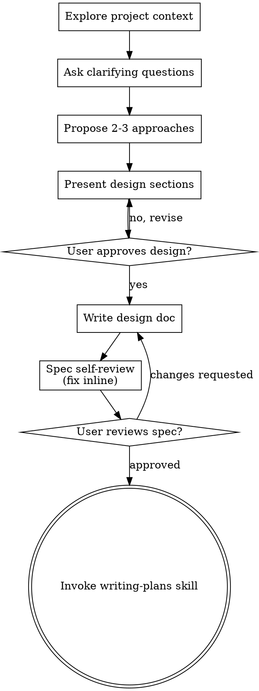

# 将创意构思为设计

通过自然的协作对话，帮助将创意转化为完整的设计和规范。

首先了解当前项目上下文，然后逐个提问以完善创意。一旦理解了要构建的内容，展示设计并获得用户批准。

<HARD-GATE>
在展示设计并获得用户批准之前，不得调用任何实施 skill、编写任何代码、搭建任何项目或采取任何实施行动。此规则适用于每个项目，无论其表面上的简单程度如何。
</HARD-GATE>

## 反模式："这个太简单了，不需要设计"

每个项目都要经历这个过程。一个待办事项列表、一个单功能工具、一个配置变更——全部如此。"简单"项目正是未经检验的假设造成最多返工的地方。设计可以很简短（对于真正简单的项目，几句话即可），但你必须展示它并获得批准。

## 检查清单

你必须为每一项创建任务，并按顺序完成它们：

1. **探索项目上下文** — 检查文件、文档、最近的 commits
2. **在恰当时机提供可视化伴侣** — 不要一开始就提供。当第一个真正通过展示比描述更清晰的问题出现时，再提供它（单独一条消息）；获得批准后，其浏览器选项卡会为你打开。如果从未出现可视化问题，则永远不要提供。请参阅下面的可视化伴侣部分。
3. **提出澄清性问题** — 一次一个，了解目的/约束/成功标准
4. **提出 2-3 种方案** — 附有权衡和你的推荐
5. **展示设计** — 按区域划分，根据复杂度缩放，在每部分后获得用户批准
6. **编写设计文档** — 保存到 `docs/superpowers/specs/YYYY-MM-DD-<topic>-design.md` 并 commit
7. **Spec 自审** — 快速内联检查是否有占位符、矛盾、歧义、范围（见下文）
8. **用户审阅书面 spec** — 让用户在实际执行前审阅 spec 文件
9. **过渡到实施** — 调用 writing-plans skill 来创建实施计划

## 流程

**终端状态是调用 writing-plans。** 不要调用 frontend-design、mcp-builder 或任何其他实施 skill。brainstorming 之后唯一调用的 skill 是 writing-plans。

## 流程

**理解创意：**

- 首先查看当前项目状态（文件、文档、最近的 commits）
- 在询问详细问题之前，评估范围：如果请求描述了多个独立的子系统（例如，"构建一个包含聊天、文件存储、计费和分析的平台"），立即标记出来。不要花时间细化需要先分解的项目的细节。
- 如果项目对于单个 spec 来说太大，帮助用户分解为子项目：什么是独立的组件，它们之间如何关联，应该按什么顺序构建？然后通过正常的设计流程对第一个子项目进行 brainstorm。每个子项目都有自己的 spec -> plan -> 实施 cycle。
- 对于范围合适的项目，一次问一个问题来完善创意
- 尽可能优先使用选择题，但开放性问题也可以
- 每条消息只问一个问题——如果一个主题需要更多探索，将其分解为多个问题
- 专注于理解：目的、约束、成功标准

**探索方案：**

- 提出 2-3 种不同的方案，附有权衡
- 以对话方式呈现选项，附上你的推荐和理由
- 先用推荐的选项引导，并解释原因

**展示设计：**

- 一旦你相信理解了构建内容，展示设计
- 按照复杂度缩放每个部分：直接明了时用几句话，需要细微处理时用 200-300 字
- 在每个部分后询问是否看起来正确
- 涵盖：架构、组件、数据流、错误处理、测试
- 准备好退回去澄清不清楚的内容

**为隔离和清晰而设计：**

- 将系统分解为更小的单元，每个单元有一个明确的用途，通过定义良好的接口通信，并且可以独立理解和测试
- 对于每个单元，你应该能够回答：它做什么，如何使用它，它依赖什么？
- 其他人能否在不阅读内部实现的情况下理解一个单元的用途？你能在不破坏使用者的情况下更改内部实现吗？如果不能，边界需要完善。
- 较小、边界清晰的单元也更容易让你处理——你对能够一次放入上下文的代码推理更好，当文件专注时你的编辑更可靠。当文件变大时，通常意味着它在做太多事情。

**在现有代码库中工作：**

- 在提议更改之前探索当前结构。遵循现有模式。
- 如果现有代码存在问题影响了工作（例如，文件变得太大、边界不清晰、职责混乱），将有针对性的改进作为设计的一部分——就像优秀的开发者在处理代码时会做的那样。
- 不要提议不相关的重构。保持专注于服务当前目标的事情。

## 设计之后

**文档化：**

- 将经过验证的设计（spec）写入 `docs/superpowers/specs/YYYY-MM-DD-<topic>-design.md`
  - （用户对 spec 位置的偏好会覆盖此默认值）
- 如果可用，可以使用 elements-of-style:writing-clearly-and-concisely skill
- 将设计文档提交到 git

**Spec 自审：**
编写 spec 文档后，用新的眼光审视它：

1. **占位符扫描：** 是否有任何"TBD"、"TODO"、不完整的部分或模糊的要求？修复它们。
2. **内部一致性：** 各部分之间是否有矛盾？架构是否与功能描述匹配？
3. **范围检查：** 这个范围是否足够集中以适合单个实施计划，还是需要分解？
4. **歧义检查：** 是否有任何要求可以以两种不同方式解释？如果有，选择一种并使其明确。

内联修复任何问题。无需重新审阅——直接修复并继续。

**用户审阅关口：**
在 spec 审阅循环通过后，让用户在实际进行之前审阅已编写的 spec：

> "Spec 已编写并提交到 `<path>`。请审阅并让我知道是否想进行任何更改，然后我们开始编写实施计划。"

等待用户的回应。如果他们要求更改，进行修改并重新运行 spec 审阅循环。只有在用户批准后才继续。

**实施：**

- 调用 writing-plans skill 来创建详细的实施计划
- 不要调用任何其他 skill。writing-plans 是下一步。

## 关键原则

- **一次一个问题** — 不要用多个问题让人不知所措
- **优先选择题** — 可能时比开放性问题更容易回答
- **严格遵循 YAGNI** — 从所有设计中移除不必要的功能
- **探索替代方案** — 在决定之前总是提出 2-3 种方案
- **渐进式验证** — 展示设计，在继续之前获得批准
- **保持灵活** — 当某些内容不清楚时，退回去澄清

## 可视化伴侣

一个基于浏览器的伴侣，用于在 brainstorming 过程中展示 mockups、图表和视觉选项。作为一个工具提供——而不是一种模式。接受伴侣意味着它可以用于那些受益于可视化处理的问题；这并不意味着每个问题都要通过浏览器。

**提供伴侣（恰当时机）：** 不要一开始就提供。等到一个问题真正通过展示比通过描述更清晰时——一个真正的 mockup / 布局 / 图表问题，而不仅仅是一个 UI *主题*。第一次出现这种情况时，以单独的消息形式提供它：
> "接下来这部分可能通过展示更容易理解——我可以边进行边在浏览器标签页中准备 mockup、图表和比较。目前还是新的，可能需要较多 token。需要我打开吗？我会为你打开。"

**这个提议必须是单独的消息。** 只有提议——没有澄清问题、总结或其他内容。等待用户的回应。如果他们接受，使用 `--open` 启动服务器，使浏览器自动打开到第一个画面。如果他们拒绝，继续纯文本模式，除非他们提起，否则不再提供。

**每个问题的决定：** 即使用户接受了，也要为每个问题决定使用浏览器还是终端。标准：**用户通过观看比通过阅读能更好地理解吗？**

- **使用浏览器** 处理本身就是视觉的内容——mockups、线框图、布局比较、架构图、并排视觉设计
- **使用终端** 处理文本内容——需求问题、概念选择、权衡列表、A/B/C/D 文本选项、范围决策

一个关于 UI 主题的问题不自动成为视觉问题。"在这个上下文中，个性是什么意思？"是一个概念性问题——使用终端。"哪种向导布局效果更好？"是一个视觉性问题——使用浏览器。

如果他们同意使用伴侣，在进行之前阅读详细指南：
`skills/brainstorming/visual-companion.md`
