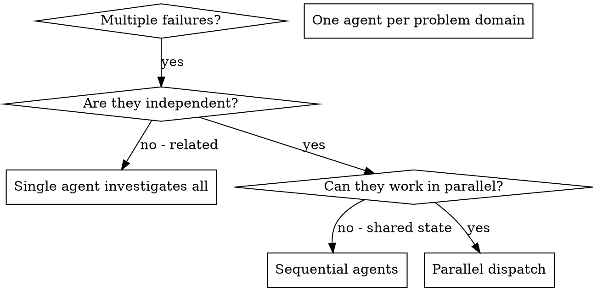

# 分派并行 Agent

## 概述

你将任务委托给具有隔离上下文的专门化 agent。通过精确构造他们的指令和上下文，确保他们保持专注并成功完成任务。他们永远不应继承你会话的上下文或历史——你仅构建他们所需的内容。这也为你自己的协调工作保留了上下文。

当你有多个不相关的故障时（不同的测试文件、不同的子系统、不同的错误），逐个调查是在浪费时间。每个调查都是独立的，可以并行进行。

**核心原则：** 每个独立的问题域分派一个 agent。让他们并发工作。

## 何时使用



**使用时机：**
- 3+ 个测试文件因不同根本原因失败
- 多个子系统独立损坏
- 每个问题可以在不需要其他问题上下文的情况下理解
- 调查之间没有共享状态

**不要使用：**
- 故障是相关的（修复一个可能修复其他）
- 需要理解完整的系统状态
- Agent 会相互干扰

## 模式

### 1. 识别独立域

按破坏的内容对故障进行分组：
- 文件 A 测试：工具审批流程
- 文件 B 测试：批处理完成行为
- 文件 C 测试：中止功能

每个域是独立的——修复工具审批不会影响中止测试。

### 2. 创建聚焦的 Agent 任务

每个 agent 获得：
- **特定范围：** 一个测试文件或子系统
- **明确目标：** 使这些测试通过
- **约束：** 不更改其他代码
- **预期输出：** 发现和修复内容的摘要

### 3. 并行分派

在同一个响应中发出所有三个 subagent 分派——它们并行运行：

```text
Subagent (general-purpose): "Fix agent-tool-abort.test.ts failures"
Subagent (general-purpose): "Fix batch-completion-behavior.test.ts failures"
Subagent (general-purpose): "Fix tool-approval-race-conditions.test.ts failures"
# All three run concurrently.
```

一个响应中的多个分派调用 = 并行执行。每个响应一个 = 串行。

### 4. 审阅和整合

当 agent 返回时：
- 阅读每个摘要
- 验证修复不冲突
- 运行完整测试套件
- 整合所有更改

## Agent 提示结构

好的 agent 提示是：
1. **聚焦的** - 一个清晰的问题域
2. **自包含的** - 理解问题所需的所有上下文
3. **关于输出具体的** - agent 应该返回什么？

```markdown
Fix the 3 failing tests in src/agents/agent-tool-abort.test.ts:

1. "should abort tool with partial output capture" - expects 'interrupted at' in message
2. "should handle mixed completed and aborted tools" - fast tool aborted instead of completed
3. "should properly track pendingToolCount" - expects 3 results but gets 0

These are timing/race condition issues. Your task:

1. Read the test file and understand what each test verifies
2. Identify root cause - timing issues or actual bugs?
3. Fix by:
   - Replacing arbitrary timeouts with event-based waiting
   - Fixing bugs in abort implementation if found
   - Adjusting test expectations if testing changed behavior

Do NOT just increase timeouts - find the real issue.

Return: Summary of what you found and what you fixed.
```

## 常见错误

**❌ 过于宽泛：** "修复所有测试" - agent 会迷失
**✅ 具体化：** "修复 agent-tool-abort.test.ts" - 聚焦范围

**❌ 没有上下文：** "修复竞态条件" - agent 不知道在哪里
**✅ 上下文：** 粘贴错误消息和测试名称

**❌ 没有约束：** Agent 可能重构所有内容
**✅ 约束：** "不要更改生产代码" 或 "仅修复测试"

**❌ 输出模糊：** "修复它" - 你不知道改变了什么
**✅ 具体：** "返回根本原因和更改的摘要"

## 何时不使用

**相关故障：** 修复一个可能修复其他——先一起调查
**需要完整上下文：** 理解需要查看整个系统
**探索性调试：** 你还不知道出了什么问题
**共享状态：** Agent 会相互干扰（编辑相同文件、使用相同资源）

## 来自会话的真实示例

**场景：** 重大重构后 3 个文件中 6 个测试失败

**故障：**
- agent-tool-abort.test.ts：3 个失败（时序问题）
- batch-completion-behavior.test.ts：2 个失败（工具未执行）
- tool-approval-race-conditions.test.ts：1 个失败（执行计数 = 0）

**决定：** 独立域——中止逻辑、批处理完成和竞态条件各自独立

**分派：**
```
Agent 1 → Fix agent-tool-abort.test.ts
Agent 2 → Fix batch-completion-behavior.test.ts
Agent 3 → Fix tool-approval-race-conditions.test.ts
```

**结果：**
- Agent 1：用基于事件的等待替换了超时
- Agent 2：修复了事件结构错误（threadId 位置错误）
- Agent 3：添加了等待异步工具执行完成

**整合：** 所有修复独立，无冲突，完整套件通过

**节省的时间：** 3 个问题并行解决 vs 串行

## 关键优势

1. **并行化** - 多个调查同时进行
2. **聚焦** - 每个 agent 范围狭窄，需要跟踪的上下文更少
3. **独立性** - Agent 不相互干扰
4. **速度** - 3 个问题在 1 个问题的时间内解决

## 验证

在 agent 返回后：
1. **审阅每个摘要** - 了解更改了什么
2. **检查冲突** - Agent 是否编辑了相同代码？
3. **运行完整套件** - 验证所有修复一起工作
4. **抽查** - Agent 可能犯系统性错误

## 实际影响

来自调试会话（2025-10-03）：
- 3 个文件中 6 个故障
- 3 个 agent 并行分派
- 所有调查同时完成
- 所有修复成功整合
- Agent 更改之间零冲突
