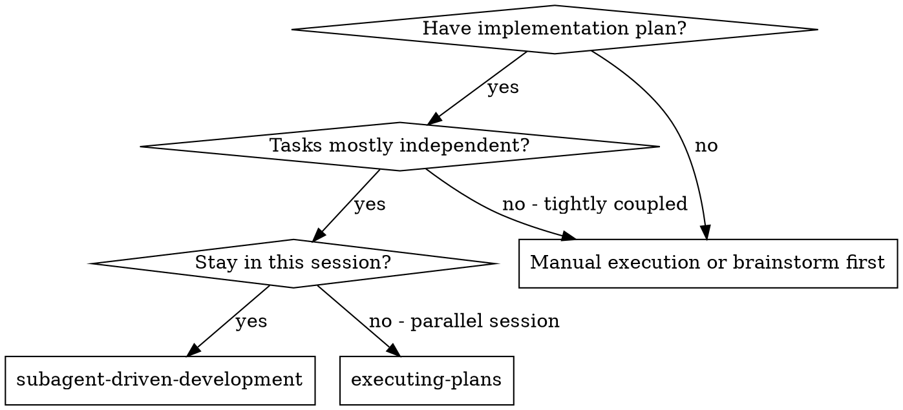
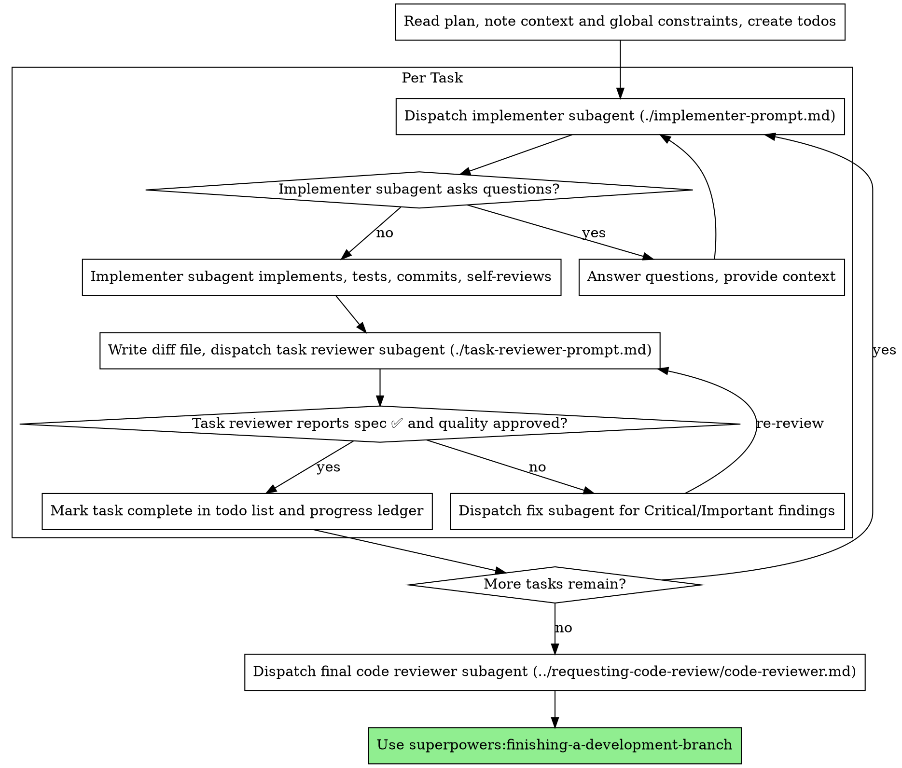

# Subagent-Driven Development

通过为每个任务分派一个全新的 implementer subagent、每个任务后的任务审查（spec 合规性 + 代码质量）以及最后的一次广泛的全分支审查来执行计划。

**为什么使用 subagent：** 你将任务委托给具有隔离上下文的专门化 agent。通过精确构造他们的指令和上下文，确保他们保持专注并成功完成任务。他们永远不应继承你会话的上下文或历史——你仅构建他们所需的内容。这也为你自己的协调工作保留了上下文。

**核心原则：** 每个任务使用新 subagent + 任务审查（spec + 质量）+ 广泛的最终审查 = 高质量、快速迭代

**叙述：** 在工具调用之间，最多叙述一行短内容——分类账和工具结果承担了记录工作。

**持续执行：** 不要在任务之间暂停与你的人类搭档确认。从计划中不间断地执行所有任务。唯一的停止原因是：你无法解决的 BLOCKED 状态、真正阻碍进展的歧义，或所有任务完成。"我应该继续吗？"的提示和进展摘要浪费他们的时间——他们让你执行计划，所以执行它。

## 何时使用



**vs. 执行计划（并行会话）：**
- 同一会话（无上下文切换）
- 每个任务使用新 subagent（无上下文污染）
- 每个任务后审查（spec 合规性 + 代码质量），最后广泛审查
- 更快的迭代（任务之间无人介入）

## 流程



## 起飞前计划审查

在分派任务 1 之前，扫描一次计划以查找冲突：

- 相互矛盾的任务，或与计划全局约束矛盾的任务
- 计划明确要求但审查标准视为缺陷的内容（断言什么都不做的测试、逻辑块的逐字重复）

将你发现的所有内容作为一批问题呈现给你的人类搭档——每个发现附上要求它的计划文本，询问哪个为准——在执行开始之前，而不是在计划执行过程中每次发现中断一次。如果扫描没有发现问题，则无需评论直接进行。审查循环仍然是捕获仅从实施中浮现的冲突的兜底机制。

## 模型选择

使用能处理每个角色的最弱模型，以节省成本并提高速度。

**机械性实施任务**（隔离函数、清晰 spec、1-2 个文件）：使用快速、便宜的模型。当计划被良好指定时，大多数实施任务是机械性的。

**集成和判断任务**（多文件协调、模式匹配、调试）：使用标准模型。

**架构和设计任务**：使用最强大的可用模型。最终的全分支审查属于此类——使用最强大的可用模型进行分派，而不是会话默认值。

**审查任务**：根据 diff 的大小、复杂度和风险，以同样的判断力选择模型。小的机械性 diff 不需要最强大的模型；微妙的并发更改则需要。

**在分派 subagent 时始终显式指定模型。** 省略模型会继承你会话的模型——通常是最强大和最昂贵的——这会在静默中违背本节的目的。

**轮次消耗胜过 token 价格。** 实际时间和上下文成本随 subagent 花费的轮次数量增长，而最便宜的模型在多步骤工作中通常需要 2-3 倍的轮次——总体成本更高。对于审阅者和从散文式描述工作的 implementer，使用中档模型作为底线。当任务的计划文本包含要编写的完整代码时，实施是转录加测试：为该 implementer 使用最便宜的层级。单文件机械修复也使用最便宜的层级。

**任务复杂度信号（实施任务）：**
- 涉及 1-2 个文件，有完整 spec → 便宜模型
- 涉及多个文件，有集成问题 → 标准模型
- 需要设计判断或广泛的代码库理解 → 最强大的模型

## 处理 Implementer 状态

Implementer subagent 报告四种状态之一。适当处理每种状态：

**DONE：** 生成审查包（`scripts/review-package BASE HEAD`，来自此 skill 的目录——它打印所写入的唯一文件路径；BASE 是你记录的在分派 implementer 之前的 commit——永远不是 `HEAD~1`，它会静默丢弃多 commit 任务中除最后一个 commit 之外的所有内容），然后使用打印的路径分派任务审阅者。

**DONE_WITH_CONCERNS：** Implementer 完成了工作但标记了疑虑。在进行之前阅读疑虑。如果疑虑涉及正确性或范围，在审查之前处理。如果是观察意见（例如，"这个文件变大了"），记录下来并进入审查。

**NEEDS_CONTEXT：** Implementer 需要未提供的信息。提供缺失的上下文并重新分派。

**BLOCKED：** Implementer 无法完成该任务。评估障碍：
1. 如果是上下文问题，提供更多上下文并使用相同模型重新分派
2. 如果任务需要更多推理，使用更强大的模型重新分派
3. 如果任务太大，将其分解为更小的部分
4. 如果计划本身是错误的，升级到人类

**永远不要**忽略升级或在没有改变的情况下强制相同模型重试。如果 implementer 说它卡住了，某些东西需要改变。

## 处理审阅者的 ⚠️ 项

任务审阅者可能报告"⚠️ Cannot verify from diff"项——即存在于未更改代码中或跨任务的需求。这些不会阻止其余的审查，但你必须在标记任务完成之前自行解决每一项：你拥有审阅者缺乏的计划和跨任务上下文。如果你确认某项是真正的缺口，将其视为失败的 spec 审查——送回给 implementer 并重新审查。

## 构建审阅者提示

每个任务的审查是任务范围的门控。广泛审查仅在最终的全分支审查中进行一次。当你填写审阅者模板时：

- 不要添加开放式指令，如"检查所有使用情况"或"如果有用，运行竞态测试"，除非有具体、特定于任务的原因
- 不要要求审阅者重新运行 implementer 已经运行过的测试——implementer 的报告携带测试证据
- 不要预判审阅者的发现——永远不要指示审阅者忽略或不标记特定问题。如果你认为某个发现会是误报，让审阅者提出并在审查循环中裁决。如果你正在编写的提示包含"不要标记"、"不要将 X 视为缺陷"、"最多为次要"或"计划选择了"——停下来：你正在预判，通常是为了让自己免于审查循环。
- 你交给审阅者的全局约束块是其注意力透镜。从计划的全局约束部分或 spec 中逐字复制绑定要求：精确值、精确格式以及组件之间的既定关系（"与 X 相同的布局"、"匹配 Y"）。审阅者的模板已经携带了流程规则（YAGNI、测试卫生、审查方法）——约束块用于此项目 spec 所要求的内容。
- 将 diff 作为文件交给审阅者：运行此 skill 的 `scripts/review-package BASE HEAD`，并将打印的文件路径传递给审阅者（或者，如果没有 bash：`git log --oneline`、`git diff --stat` 和 `git diff -U10` 用于范围，重定向到一个唯一命名的文件）。输出永远不会进入你自己的上下文，审阅者通过一次 Read 调用即可看到 commit 列表、统计摘要和带上下文的完整 diff。使用你在分派 implementer 之前记录的 BASE——永远不要使用 `HEAD~1`，它会静默截断多 commit 任务。
- 分派提示描述一个任务，而不是会话的历史。不要将累积的先前任务摘要（"任务 1-3 之后的状态"）粘贴到后续分派中——实际会话中某个分派达到了 42k 字符，其中 99% 是粘贴的历史记录。一个全新的 subagent 需要它的任务、它接触的接口和全局约束。没有别的。
- 为关键和重要发现分派修复 subagent。在小发现前进时将记录到进展分类账中，并在最终的全分支审查中指出该列表，以便它能够分类哪些必须在合并前修复。无人阅读的汇总就是静默丢弃。
- 标记为计划强制的发现——或任何与计划文本要求冲突的发现——是人类的决定，就像任何计划矛盾一样：呈现发现和计划文本，询问哪个为准。不要因为计划强制要求而驳回发现，也不要分派与计划矛盾的修复而不询问。
- 最终的全分支审查也获得一个包：运行 `scripts/review-package MERGE_BASE HEAD`（MERGE_BASE = 分支开始的 commit，例如 `git merge-base main HEAD`），并将打印的路径包含在最终审查分派中，这样最终审阅者读取一个文件，而不是用 git 命令重新导出分支 diff。
- 每次修复分派都附带 implementer 契约：修复 subagent 重新运行覆盖其更改的测试并报告结果。在分派中指定覆盖的测试文件——一行修复不需要整个套件。在重新分派审阅者之前，确认修复报告包含覆盖的测试、运行的命令和输出；一旦全部三个都存在，分派重新审查。
- 如果最终的全分支审查返回发现，分派一个修复 subagent 带有完整的发现列表——而不是每个发现一个修复 agent。每个发现一个修复 agent 会各自重建上下文并重新运行套件；实际会话中最终审查的修复波成本超过了所有任务的总和。

## 文件交接

你粘贴到分派提示中的所有内容——以及 subagent 打印回的所有内容——都会在会话的剩余时间内驻留在你的上下文中，并在后续每一轮中被重新读取。将工件作为文件交接：

- **任务简报：** 在分派 implementer 之前，运行此 skill 的 `scripts/task-brief PLAN_FILE N`——它将任务的完整文本提取到一个唯一命名的文件并打印路径。撰写分派时让简报作为需求的唯一来源。你的分派应包含：(1) 一行说明此任务在项目中的位置；(2) 简报路径，以"首先阅读此文件——这是你的需求，包含要逐字使用的精确值"引入；(3) 先前任务中简报无法知道的接口和决策；(4) 你对简报中注意到的任何歧义的解决方案；(5) 报告文件路径和报告契约。精确值（数字、魔数、签名、测试用例）仅出现在简报中。
- **报告文件：** 以简报命名 implementer 的报告文件（简报 `…/task-N-brief.md` → 报告 `…/task-N-report.md`），并将其放在分派提示中。Implementer 在那里写入完整报告，并仅返回状态、commits、一行测试摘要和疑虑。
- **审阅者输入：** 任务审阅者获得三个路径——相同的简报文件、报告文件和审查包——以及绑定该任务的全局约束。
- 修复分派将其修复报告（含测试结果）追加到相同的报告文件中，并返回简短摘要；重新审阅读取更新后的文件。

## 持久化进展

对话记忆无法在压缩后存活。在实际会话中，失去位置的控制器重新分派了已完成的整个任务序列——这是观察到的最昂贵的故障。在分类账文件中跟踪进展，而不仅仅在 todo 中。

- 在 skill 启动时，检查分类账：`cat "$(git rev-parse --show-toplevel)/.superpowers/sdd/progress.md"`。那里列为完成的任务就是 DONE——不要重新分派它们；在第一个未标记为完成的任务处继续。
- 当任务的审查通过时，在与你的其他簿记相同的消息中向分类账追加一行：`Task N: complete (commits <base7>..<head7>, review clean)`。
- 分类账是你的恢复地图：它命名的 commits 存在于 git 中，即使你的上下文不再记得创建它们。压缩后，信任分类账和 `git log`，而不是你自己的记忆。
- `git clean -fdx` 会销毁分类账（它是 git-ignored 的临时文件）；如果发生这种情况，从 `git log` 恢复。

## 提示模板

- [implementer-prompt.md](implementer-prompt.md) - 分派 implementer subagent
- [task-reviewer-prompt.md](task-reviewer-prompt.md) - 分派任务审阅者 subagent（spec 合规性 + 代码质量）
- 最终全分支审查：使用 superpowers:requesting-code-review 的 [code-reviewer.md](../requesting-code-review/code-reviewer.md)

## 示例工作流

```
You: I'm using Subagent-Driven Development to execute this plan.

[Read plan file once: docs/superpowers/plans/feature-plan.md]
[Create todos for all tasks]

Task 1: Hook installation script

[Run task-brief for Task 1; dispatch implementer with brief + report paths + context]

Implementer: "Before I begin - should the hook be installed at user or system level?"

You: "User level (~/.config/superpowers/hooks/)"

Implementer: "Got it. Implementing now..."
[Later] Implementer:
  - Implemented install-hook command
  - Added tests, 5/5 passing
  - Self-review: Found I missed --force flag, added it
  - Committed

[Run review-package, dispatch task reviewer with the printed path]
Task reviewer: Spec ✅ - all requirements met, nothing extra.
  Strengths: Good test coverage, clean. Issues: None. Task quality: Approved.

[Mark Task 1 complete]

Task 2: Recovery modes

[Run task-brief for Task 2; dispatch implementer with brief + report paths + context]

Implementer: [No questions, proceeds]
Implementer:
  - Added verify/repair modes
  - 8/8 tests passing
  - Self-review: All good
  - Committed

[Run review-package, dispatch task reviewer with the printed path]
Task reviewer: Spec ❌:
  - Missing: Progress reporting (spec says "report every 100 items")
  - Extra: Added --json flag (not requested)
  Issues (Important): Magic number (100)

[Dispatch fix subagent with all findings]
Fixer: Removed --json flag, added progress reporting, extracted PROGRESS_INTERVAL constant

[Task reviewer reviews again]
Task reviewer: Spec ✅. Task quality: Approved.

[Mark Task 2 complete]

...

[After all tasks]
[Dispatch final code-reviewer]
Final reviewer: All requirements met, ready to merge

Done!
```

## 优势

**vs. 手动执行：**
- Subagent 自然遵循 TDD
- 每个任务使用新上下文（无混淆）
- 并行安全（subagent 不干扰）
- Subagent 可以提问（在工作前和工作中）

**vs. 执行计划：**
- 同一会话（无交接）
- 持续进展（无需等待）
- 自动审查检查点

**效率提升：**
- 控制器精确策划所需上下文；批量工件以文件形式移动，而非粘贴文本
- Subagent 一次性获得完整信息
- 问题在开始工作前被提出（而非之后）

**质量门控：**
- 自审在交接前捕获问题
- 任务审查带有两个裁决：spec 合规性和代码质量
- 审查循环确保修复确实有效
- Spec 合规性防止过度/不足构建
- 代码质量确保实施构建良好

**成本：**
- 更多 subagent 调用（每个任务 implementer + 审阅者）
- 控制器做更多准备工作（提前提取所有任务）
- 审查循环增加迭代
- 但及早捕获问题（比以后调试更便宜）

## 红旗

**永远不要：**
- 在未经用户明确同意的情况下在 main/master 分支上开始实施
- 跳过任务审查，或接受缺少任一裁决的报告（spec 合规性和任务质量都是必需的）
- 在存在未修复问题的情况下继续
- 并行分派多个实施 subagent（冲突）
- 让 subagent 读取整个计划文件（而是交给它任务简报——`scripts/task-brief`）
- 跳过场景设置上下文（subagent 需要了解任务在何处")
- 忽略 subagent 的问题（在让他们继续之前回答）
- 在 spec 合规性上接受"差不多"（审阅者发现 spec 问题 = 未完成）
- 跳过审查循环（审阅者发现问题 = implementer 修复 = 再次审查）
- 让 implementer 的自审替代实际审查（两者都是必需的）
- 告诉审阅者不要标记什么，或在分派提示中预评发现的严重程度（"最多视为次要"）——计划的示例代码是起点，不是其弱点被选择的证据
- 在没有 diff 文件的情况下分派任务审阅者——首先生成它（`scripts/review-package BASE HEAD`）并在提示中指明打印的路径
- 在审查存在未解决的关键/重要问题时进入下一个任务
- 重新分派进展分类账已经标记为完成的任务——在任何压缩或恢复后检查分类账（和 `git log`）

**如果 subagent 提问：**
- 清晰且完整地回答
- 如果需要，提供额外上下文
- 不要催促他们实施

**如果审阅者发现问题：**
- Implementer（同一 subagent）修复它们
- 审阅者再次审查
- 重复直到批准
- 不要跳过重新审查

**如果 subagent 任务失败：**
- 使用具体指示分派修复 subagent
- 不要手动尝试修复（上下文污染）

## 集成

**必需的工作流 skills：**
- **superpowers:using-git-worktrees** - 确保隔离的工作空间（创建或验证现有）
- **superpowers:writing-plans** - 创建此 skill 执行的计划
- **superpowers:requesting-code-review** - 用于最终全分支审查的代码审查模板
- **superpowers:finishing-a-development-branch** - 在所有任务完成后完成开发

**Subagent 应该使用：**
- **superpowers:test-driven-development** - Subagent 对每个任务遵循 TDD

**替代工作流：**
- **superpowers:executing-plans** - 用于并行会话而非同会话执行
