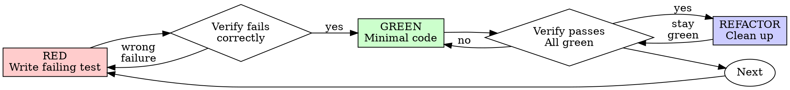

# 测试驱动开发（TDD）

## 概述

先编写测试。看着它失败。编写最少的代码使其通过。

**核心原则：** 如果你没有看着测试失败，你就不知道它是否测试了正确的东西。

**违反规则的文字就是违反规则的精神。**

## 何时使用

**始终：**
- 新功能
- Bug 修复
- 重构
- 行为变更

**例外（询问你的人类搭档）：**
- 一次性原型
- 生成的代码
- 配置文件

想着"就这一次跳过 TDD"？停下来。那是合理化。

## 铁律

```
NO PRODUCTION CODE WITHOUT A FAILING TEST FIRST
```

在测试之前写了代码？删除它。重新开始。

**没有例外：**
- 不要把它当作"参考"
- 不要在编写测试时"调整"它
- 不要看它
- 删除就是删除

从测试开始全新实施。句号。

## 红-绿-重构



### RED - 编写失败测试

编写一个最小的测试，展示应该发生什么。

<Good>
```typescript
test('retries failed operations 3 times', async () => {
  let attempts = 0;
  const operation = () => {
    attempts++;
    if (attempts < 3) throw new Error('fail');
    return 'success';
  };

  const result = await retryOperation(operation);

  expect(result).toBe('success');
  expect(attempts).toBe(3);
});
```
清晰名称，测试真实行为，一件事情
</Good>

<Bad>
```typescript
test('retry works', async () => {
  const mock = jest.fn()
    .mockRejectedValueOnce(new Error())
    .mockRejectedValueOnce(new Error())
    .mockResolvedValueOnce('success');
  await retryOperation(mock);
  expect(mock).toHaveBeenCalledTimes(3);
});
```
模糊名称，测试 mock 而不是代码
</Bad>

**要求：**
- 一种行为
- 清晰的名称
- 真实代码（除非不可避免，否则不使用 mock）

### 验证 RED - 看着它失败

**必须执行。永远不要跳过。**

```bash
npm test path/to/test.test.ts
```

确认：
- 测试失败（而不是报错）
- 失败信息符合预期
- 失败是因为功能缺失（而不是拼写错误）

**测试通过了？** 你在测试现有行为。修复测试。

**测试报错了？** 修复错误，重新运行直到正确失败。

### GREEN - 最少的代码

编写最简单的代码来通过测试。

<Good>
```typescript
async function retryOperation<T>(fn: () => Promise<T>): Promise<T> {
  for (let i = 0; i < 3; i++) {
    try {
      return await fn();
    } catch (e) {
      if (i === 2) throw e;
    }
  }
  throw new Error('unreachable');
}
```
刚好足以通过
</Good>

<Bad>
```typescript
async function retryOperation<T>(
  fn: () => Promise<T>,
  options?: {
    maxRetries?: number;
    backoff?: 'linear' | 'exponential';
    onRetry?: (attempt: number) => void;
  }
): Promise<T> {
  // YAGNI
}
```
过度设计
</Bad>

不要添加功能、重构其他代码或"改进"超越测试的范围。

### 验证 GREEN - 看着它通过

**必须执行。**

```bash
npm test path/to/test.test.ts
```

确认：
- 测试通过
- 其他测试仍然通过
- 输出干净（无错误、警告）

**测试失败了？** 修复代码，而不是测试。

**其他测试失败了？** 立即修复。

### REFACTOR - 清理

仅在绿色之后：
- 消除重复
- 改进命名
- 提取辅助函数

保持测试通过。不添加行为。

### 重复

下一个功能的下一个失败测试。

## 好的测试

| Quality | Good | Bad |
|---------|------|-----|
| **Minimal** | One thing. "and" in name? Split it. | `test('validates email and domain and whitespace')` |
| **Clear** | Name describes behavior | `test('test1')` |
| **Shows intent** | Demonstrates desired API | Obscures what code should do |

## 为什么顺序很重要

**"我会之后编写测试来验证它有效"**

之后编写的测试立即通过。立即通过证明不了什么：
- 可能测试了错误的东西
- 可能测试了实现，而不是行为
- 可能遗漏了你忘记的边缘情况
- 你从未见过它捕获 bug

测试优先迫使你看到测试失败，证明它确实在测试某些东西。

**"我已经手动测试了所有边缘情况"**

手动测试是临时的。你以为你测试了所有东西但其实：
- 没有测试记录
- 代码更改后无法重新运行
- 压力下容易忘记情况
- "我试过它有效" ≠ 全面

自动化测试是系统性的。它们每次都相同方式运行。

**"删除 X 小时的工作是浪费"**

沉没成本谬误。时间已经过去了。你现在选择：
- 删除并用 TDD 重写（再花 X 小时，高可信度）
- 保留它并在之后添加测试（30 分钟，低可信度，可能有 bug）

"浪费"是保留你无法信任的代码。没有真正测试的工作代码是技术债务。

**"TDD 是教条的，务实意味着适应"**

TDD 本身就是务实的：
- 在 commit 之前发现 bug（比之后调试更快）
- 防止回归（测试立即捕获破坏）
- 文档化行为（测试展示如何使用代码）
- 启用重构（自由更改，测试捕获破坏）

"务实"的捷径 = 在生产中调试 = 更慢。

**"之后测试达到相同目标——这是精神而不是仪式"**

不是。之后测试回答"这做什么？"测试优先回答"这应该做什么？"

之后测试被你的实现所偏倚。你测试你构建的东西，而不是需要的东西。你验证你记住的边缘情况，而不是发现的边缘情况。

测试优先强制在实现之前发现边缘情况。之后测试验证你记住了一切（你并没有）。

30 分钟的之后测试 ≠ TDD。你得到了覆盖率，失去了测试有效的证明。

## 常见合理化

| Excuse | Reality |
|--------|---------|
| "Too simple to test" | Simple code breaks. Test takes 30 seconds. |
| "I'll test after" | Tests passing immediately prove nothing. |
| "Tests after achieve same goals" | Tests-after = "what does this do?" Tests-first = "what should this do?" |
| "Already manually tested" | Ad-hoc ≠ systematic. No record, can't re-run. |
| "Deleting X hours is wasteful" | Sunk cost fallacy. Keeping unverified code is technical debt. |
| "Keep as reference, write tests first" | You'll adapt it. That's testing after. Delete means delete. |
| "Need to explore first" | Fine. Throw away exploration, start with TDD. |
| "Test hard = design unclear" | Listen to test. Hard to test = hard to use. |
| "TDD will slow me down" | TDD faster than debugging. Pragmatic = test-first. |
| "Manual test faster" | Manual doesn't prove edge cases. You'll re-test every change. |
| "Existing code has no tests" | You're improving it. Add tests for existing code. |

## 红旗——停止并重新开始

- 在测试之前写代码
- 在实现之后写测试
- 测试立即通过
- 无法解释为什么测试失败
- 测试"稍后"添加
- 合理化"就这一次"
- "我已经手动测试过了"
- "之后测试达到相同目的"
- "这是关于精神而不是仪式"
- "保留作为参考"或"调整现有代码"
- "已经花了几小时，删除是浪费"
- "TDD 是教条的，我是在务实"
- "这不同因为..."

**所有这些意味着：删除代码。用 TDD 重新开始。**

## 示例：Bug 修复

**Bug：** 接受空 email

**RED**
```typescript
test('rejects empty email', async () => {
  const result = await submitForm({ email: '' });
  expect(result.error).toBe('Email required');
});
```

**验证 RED**
```bash
$ npm test
FAIL: expected 'Email required', got undefined
```

**GREEN**
```typescript
function submitForm(data: FormData) {
  if (!data.email?.trim()) {
    return { error: 'Email required' };
  }
  // ...
}
```

**验证 GREEN**
```bash
$ npm test
PASS
```

**REFACTOR**
如果需要，为多个字段提取验证。

## 验证检查清单

在标记工作完成之前：

- [ ] 每个新函数/方法都有测试
- [ ] 在实现之前看到了每个测试失败
- [ ] 每个测试因预期原因失败（功能缺失，不是拼写错误）
- [ ] 编写了最少的代码来通过每个测试
- [ ] 所有测试通过
- [ ] 输出干净（无错误、警告）
- [ ] 测试使用真实代码（除非不可避免，否则不使用 mock）
- [ ] 覆盖了边缘情况和错误

不能勾选所有项？你跳过了 TDD。重新开始。

## 卡住时

| Problem | Solution |
|---------|----------|
| Don't know how to test | Write wished-for API. Write assertion first. Ask your human partner. |
| Test too complicated | Design too complicated. Simplify interface. |
| Must mock everything | Code too coupled. Use dependency injection. |
| Test setup huge | Extract helpers. Still complex? Simplify design. |

## 调试集成

发现了 bug？编写失败的测试来复现它。遵循 TDD 循环。测试证明修复并防止回归。

没有测试绝不修复 bug。

## 测试反模式

在添加 mock 或测试工具时，阅读 [testing-anti-patterns.md](testing-anti-patterns.md) 以避免常见陷阱：
- 测试 mock 行为而不是真实行为
- 向生产类添加仅测试使用的方法
- 在不了解依赖关系的情况下 mock

## 最终规则

```
Production code → test exists and failed first
Otherwise → not TDD
```

没有你的人类搭档的许可，没有例外。
