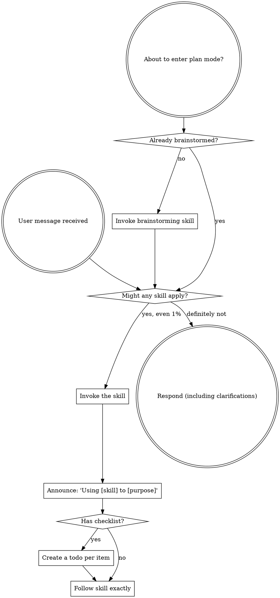

<SUBAGENT-STOP>
如果你作为 subagent 被分派来执行特定任务，请跳过本 skill。
</SUBAGENT-STOP>

<EXTREMELY-IMPORTANT>
如果你认为有哪怕 1% 的可能性某个 skill 适用于你正在做的事情，你**绝对必须**调用该 skill。

如果某个 skill 适用于你的任务，你没有选择的余地。你必须使用它。

这是不可协商的。这是不可选的。你无法通过理性化来逃避这一点。
</EXTREMELY-IMPORTANT>

## 指令优先级

Superpowers skill 会覆盖默认的系统 prompt 行为，但**用户的显式指令始终优先**：

1. **用户的显式指令**（CLAUDE.md、GEMINI.md、AGENTS.md、直接请求）——最高优先级
2. **Superpowers skill**——在与默认系统行为冲突时覆盖它们
3. **默认系统 prompt**——最低优先级

如果 CLAUDE.md、GEMINI.md 或 AGENTS.md 说"不要使用 TDD"而某个 skill 说"始终使用 TDD"，请遵循用户的指令。用户才是掌控者。

## 如何访问 Skill

**永远不要使用文件工具手动读取 skill 文件**——始终使用你平台的 skill 加载机制，以便 skill 被正确激活。

**在 Claude Code 中：** 使用 `Skill` tool。当你调用 skill 时，其内容会被加载并展示给你——直接遵循即可。

**在 Codex 中：** Skill 原生加载。遵循 skill 激活时呈现的指令。

**在 Copilot CLI 中：** 使用 `skill` tool。Skill 从已安装的 plugin 中自动发现。

**在 Gemini CLI 中：** Skill 通过 `activate_skill` tool 激活。Gemini 在会话启动时加载 skill 元数据，并按需激活完整内容。

**在其他环境中：** 查看你平台的文档以了解如何加载 skill。

## 平台适配

Skill 使用动作语言（"dispatch subagent"、"创建 todo"、"读取文件"）而非命名任何特定运行时的工具。如需按平台的工具等价物和指令文件约定，请参见 [claude-code-tools.md](references/claude-code-tools.md)、[codex-tools.md](references/codex-tools.md)、[copilot-tools.md](references/copilot-tools.md)、[gemini-tools.md](references/gemini-tools.md)、[pi-tools.md](references/pi-tools.md) 和 [antigravity-tools.md](references/antigravity-tools.md)。Gemini CLI 用户会通过 GEMINI.md 自动加载工具映射。

# 使用 Skill

## 规则

**在任何响应或行动之前，调用相关的或请求的 skill。** 即使只有 1% 的可能性某个 skill 可能适用，你也应该调用该 skill 来检查。如果调用的 skill 最终不适用于当前情况，你不需要使用它。

## 红旗

这些想法意味着停止——你在理性化：

| Thought | Reality |
|---------|---------|
| "这只是个简单问题" | 问题就是任务。检查 skill。 |
| "我需要更多上下文" | Skill 检查在澄清问题之前进行。 |
| "让我先探索代码库" | Skill 告诉你如何探索。先检查。 |
| "我可以快速检查 git/文件" | 文件缺乏对话上下文。检查 skill。 |
| "让我先收集信息" | Skill 告诉你如何收集信息。 |
| "这不需要正式的 skill" | 如果存在 skill，就使用它。 |
| "我记得这个 skill" | Skill 会进化。阅读当前版本。 |
| "这不算任务" | 行动 = 任务。检查 skill。 |
| "用 skill 是大材小用" | 简单的事情也会变复杂。使用它。 |
| "我先做这一件事" | 在做事之前先检查。 |
| "这感觉很高效" | 无纪律的行动浪费时间。Skill 可以防止这一点。 |
| "我知道那是什么意思" | 知道概念 ≠ 使用 skill。调用它。 |

## Skill 优先级

当多个 skill 可能适用时，按以下顺序使用：

1. **流程 skill 优先**（brainstorming、systematic-debugging）——它们决定了如何接近任务
2. **实现 skill 其次**（frontend-design、mcp-builder）——它们指导执行

"我们来构建 X" → 先 brainstorming，然后实现 skill。
"修复这个 bug" → 先 systematic-debugging，然后领域特定 skill。

## Skill 类型

**刚性**（TDD、systematic-debugging）：完全遵循。不要因适应而放弃纪律。

**灵活**（patterns）：根据上下文调整原则。

Skill 本身会告诉你它的类型。

## 用户指令

指令说 WHAT，而非 HOW。"添加 X"或"修复 Y"并不意味着跳过工作流。
