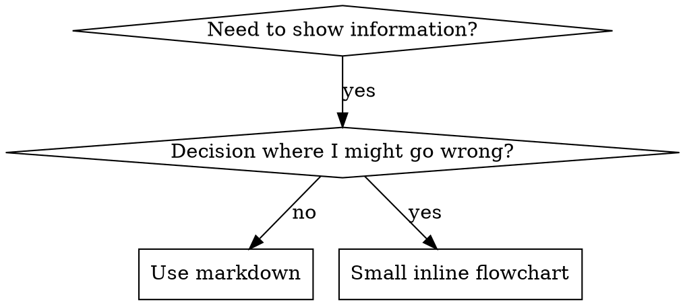

# 编写 Skills

## 概述

**编写 Skills 就是将测试驱动开发应用于流程文档。**

**个人 skills 位于运行时的 skills 目录中**——请参阅 [claude-code-tools.md](../using-superpowers/references/claude-code-tools.md)、[codex-tools.md](../using-superpowers/references/codex-tools.md)、[copilot-tools.md](../using-superpowers/references/copilot-tools.md) 或 [gemini-tools.md](../using-superpowers/references/gemini-tools.md) 了解运行时对应的路径。Codex、Copilot CLI 和 Gemini CLI 也将 `~/.agents/skills/` 识别为跨运行时别名。

你编写测试用例（带 subagent 的压力场景），看着它们失败（基线行为），编写 skill（文档），看着测试通过（agent 合规），并重构（封闭漏洞）。

**核心原则：** 如果你没有看着 agent 在没有 skill 的情况下失败，你就不知道 skill 是否教会了正确的东西。

**必需的前置知识：** 在使用此 skill 之前，你必须理解 superpowers:test-driven-development。该 skill 定义了基本的 RED-GREEN-REFACTOR 循环。此 skill 将 TDD 适配到文档。

**官方指南：** 有关 Anthropic 的官方技能编写最佳实践，请参见 anthropic-best-practices.md。本文档提供了额外的模式和指南，补充了此 skill 中以 TDD 为重点的方法。

## 什么是 Skill？

**Skill** 是一种关于经过验证的技术、模式或工具的参考指南。Skills 帮助未来的 agent 找到并应用有效的方法。

**Skills 是：** 可复用的技术、模式、工具、参考指南

**Skills 不是：** 关于你如何解决一次问题的叙述

## Skills 的 TDD 映射

| TDD Concept | Skill Creation |
|-------------|----------------|
| **Test case** | Pressure scenario with subagent |
| **Production code** | Skill document (SKILL.md) |
| **Test fails (RED)** | Agent violates rule without skill (baseline) |
| **Test passes (GREEN)** | Agent complies with skill present |
| **Refactor** | Close loopholes while maintaining compliance |
| **Write test first** | Run baseline scenario BEFORE writing skill |
| **Watch it fail** | Document exact rationalizations agent uses |
| **Minimal code** | Write skill addressing those specific violations |
| **Watch it pass** | Verify agent now complies |
| **Refactor cycle** | Find new rationalizations → plug → re-verify |

整个 skill 创建过程遵循 RED-GREEN-REFACTOR。

## 何时创建 Skill

**创建时机：**
- 某种技术对你来说不是直观明显的
- 你会跨项目再次引用这个
- 模式广泛适用（不是项目特定的）
- 其他人会受益

**不要创建：**
- 一次性解决方案
- 其他地方已文档化的标准实践
- 项目特定的约定（放在你的指令文件中）
- 机械性约束（如果可以用 regex/validation 强制实现，就自动化它——将文档留给需要判断的内容）

## Skill 类型

### 技术
带有步骤可遵循的具体方法（condition-based-waiting、root-cause-tracing）

### 模式
思考问题的方式（flatten-with-flags、test-invariants）

### 参考
API 文档、语法指南、工具文档（office docs）

## 目录结构

```
skills/
  skill-name/
    SKILL.md              # Main reference (required)
    supporting-file.*     # Only if needed
```

**扁平命名空间** - 所有 skills 在一个可搜索的命名空间中

**单独文件用于：**
1. **重型参考**（100+ 行）- API 文档、综合语法
2. **可复用工具** - 脚本、工具、模板

**保持内联：**
- 原则和概念
- 代码模式（< 50 行）
- 其他所有内容

## SKILL.md 结构

**前置元数据（YAML）：**
- 两个必填字段：`name` 和 `description`（参见 [agentskills.io/specification](https://agentskills.io/specification) 了解所有支持的字段）
- 总计最多 1024 个字符
- `name`：仅使用字母、数字和连字符（无括号、特殊字符）
- `description`：第三人称，仅描述何时使用（不是它做什么）
  - 以"Use when..."开头，聚焦于触发条件
  - 包括特定的症状、情况和上下文
  - **永远不要总结 skill 的流程或工作流**（参见 SDO 部分了解原因）
  - 如果可能，保持在 500 个字符以下

```markdown
---
name: Skill-Name-With-Hyphens
description: Use when [specific triggering conditions and symptoms]
---

# Skill Name

## Overview
What is this? Core principle in 1-2 sentences.

## When to Use
[Small inline flowchart IF decision non-obvious]

Bullet list with SYMPTOMS and use cases
When NOT to use

## Core Pattern (for techniques/patterns)
Before/after code comparison

## Quick Reference
Table or bullets for scanning common operations

## Implementation
Inline code for simple patterns
Link to file for heavy reference or reusable tools

## Common Mistakes
What goes wrong + fixes

## Real-World Impact (optional)
Concrete results
```

## Skill 发现优化（SDO）

**对发现至关重要：** 未来的 agent 需要找到你的 skill

### 1. 丰富的 Description 字段

**目的：** 你的 agent 读取 description 来决定为给定任务加载哪些 skills。让它回答："我现在应该读这个 skill 吗？"

**格式：** 以"Use when..."开头，聚焦于触发条件

**关键：Description = 何时使用，不是 Skill 做什么**

Description 应该只描述触发条件。不要在 description 中总结 skill 的流程或工作流。

**为什么这很重要：** 测试揭示，当 description 总结了 skill 的工作流时，agent 可能遵循 description 而不是阅读完整的 skill 内容。一个说"任务之间进行代码审查"的 description 导致 agent 只做了一次审查，即使 skill 的流程图清楚显示两次审查（先是 spec 合规性，然后是代码质量）。

当 description 改为仅仅"Use when executing implementation plans with independent tasks"（没有工作流摘要）时，agent 正确地阅读了流程图并遵循了两阶段审查过程。

**陷阱：** 总结工作流的 description 创建了 agent 会走的捷径。Skill 主体成为 agent 跳过的文档。

```yaml
# ❌ BAD: Summarizes workflow - agents may follow this instead of reading skill
description: Use when executing plans - dispatches subagent per task with code review between tasks

# ❌ BAD: Too much process detail
description: Use for TDD - write test first, watch it fail, write minimal code, refactor

# ✅ GOOD: Just triggering conditions, no workflow summary
description: Use when executing implementation plans with independent tasks in the current session

# ✅ GOOD: Triggering conditions only
description: Use when implementing any feature or bugfix, before writing implementation code
```

**内容：**
- 使用表明此 skill 适用的具体触发条件、症状和情况
- 描述*问题*（竞态条件、不一致行为）而不是*特定于语言的症状*（setTimeout、sleep）
- 保持触发条件与技术无关，除非 skill 本身是特定于技术的
- 如果 skill 是特定于技术的，在触发条件中明确说明
- 以第三人称编写（注入到系统提示中）
- **永远不要总结 skill 的流程或工作流**

```yaml
# ❌ BAD: Too abstract, vague, doesn't include when to use
description: For async testing

# ❌ BAD: First person
description: I can help you with async tests when they're flaky

# ❌ BAD: Mentions technology but skill isn't specific to it
description: Use when tests use setTimeout/sleep and are flaky

# ✅ GOOD: Starts with "Use when", describes problem, no workflow
description: Use when tests have race conditions, timing dependencies, or pass/fail inconsistently

# ✅ GOOD: Technology-specific skill with explicit trigger
description: Use when using React Router and handling authentication redirects
```

### 2. 关键词覆盖

使用 agent 会搜索的词：
- 错误消息："Hook timed out"、"ENOTEMPTY"、"race condition"
- 症状："flaky"、"hanging"、"zombie"、"pollution"
- 同义词："timeout/hang/freeze"、"cleanup/teardown/afterEach"
- 工具：实际命令、库名、文件类型

### 3. 描述性命名

**使用主动语态，动词在前：**
- ✅ `creating-skills` 而不是 `skill-creation`
- ✅ `condition-based-waiting` 而不是 `async-test-helpers`

### 4. Token 效率（关键）

**问题：** 入门和频繁引用的 skills 加载到每次对话中。每个 token 都很重要。

**目标字数：**
- 入门工作流：每个 <150 词
- 频繁加载的 skills：总共 <200 词
- 其他 skills：<500 词（仍然要简洁）

**技巧：**

**将细节移至工具帮助：**
```bash
# ❌ BAD: Document all flags in SKILL.md
search-conversations supports --text, --both, --after DATE, --before DATE, --limit N

# ✅ GOOD: Reference --help
search-conversations supports multiple modes and filters. Run --help for details.
```

**使用交叉引用：**
```markdown
# ❌ BAD: Repeat workflow details
When searching, dispatch subagent with template...
[20 lines of repeated instructions]

# ✅ GOOD: Reference other skill
Always use subagents (50-100x context savings). REQUIRED: Use [other-skill-name] for workflow.
```

**压缩示例：**
```markdown
# ❌ BAD: Verbose example (42 words)
your human partner: "How did we handle authentication errors in React Router before?"
You: I'll search past conversations for React Router authentication patterns.
[Dispatch subagent with search query: "React Router authentication error handling 401"]

# ✅ GOOD: Minimal example (20 words)
Partner: "How did we handle auth errors in React Router?"
You: Searching...
[Dispatch subagent → synthesis]
```

**消除冗余：**
- 不要重复交叉引用的 skills 中已有的内容
- 不要解释从命令中显而易见的内容
- 不要包含同一模式的多个示例

**验证：**
```bash
wc -w skills/path/SKILL.md
# getting-started workflows: aim for <150 each
# Other frequently-loaded: aim for <200 total
```

**按你做什么或核心见解命名：**
- ✅ `condition-based-waiting` > `async-test-helpers`
- ✅ `using-skills` 不是 `skill-usage`
- ✅ `flatten-with-flags` > `data-structure-refactoring`
- ✅ `root-cause-tracing` > `debugging-techniques`

**动名词（-ing）对流程很有效：**
- `creating-skills`、`testing-skills`、`debugging-with-logs`
- 主动，描述你正在采取的行动

### 5. 交叉引用其他 Skills

**当编写引用其他 skills 的文档时：**

仅使用 skill 名称，带有显式需求标记：
- ✅ 好的：`**必需的子 skill：** 使用 superpowers:test-driven-development`
- ✅ 好的：`**必需的前置知识：** 你必须理解 superpowers:systematic-debugging`
- ❌ 差的：`See skills/testing/test-driven-development`（不清楚是否需要）
- ❌ 差的：`@skills/testing/test-driven-development/SKILL.md`（强制加载，消耗上下文）

**为什么不用 @ 链接：** `@` 语法立即强制加载文件，在需要之前消耗 200k+ 上下文。

## 流程图使用



**仅对以下情况使用流程图：**
- 非显而易见的决策点
- 可能过早停止的流程循环
- "何时使用 A vs B" 决策

**永远不要对以下情况使用流程图：**
- 参考材料 → 表格、列表
- 代码示例 → Markdown 块
- 线性指令 → 编号列表
- 没有语义含义的标签（step1、helper2）

参见此目录中的 `graphviz-conventions.dot` 了解 graphviz 样式规则。

**为你的人类搭档可视化：** 使用此目录中的 `render-graphs.js` 将 skill 的流程图渲染为 SVG：
```bash
./render-graphs.js ../some-skill           # Each diagram separately
./render-graphs.js ../some-skill --combine # All diagrams in one SVG
```

## 代码示例

**一个优秀的例子胜过许多平庸的例子**

选择最相关的语言：
- 测试技术 → TypeScript/JavaScript
- 系统调试 → Shell/Python
- 数据处理 → Python

**好例子：**
- 完整且可运行
- 有良好的注释解释 WHY
- 来自真实场景
- 清晰地展示模式
- 可以调整使用（不是通用模板）

**不要：**
- 用 5+ 种语言实现
- 创建填空模板
- 编写牵强的例子

你善于移植——一个优秀的例子就够了。

## 文件组织

### 自包含 Skill
```
defense-in-depth/
  SKILL.md    # Everything inline
```
当：所有内容都适合，不需要重型参考

### 带有可复用工具的 Skill
```
condition-based-waiting/
  SKILL.md    # Overview + patterns
  example.ts  # Working helpers to adapt
```
当：工具是可复用代码，而不仅仅是叙述

### 带有重型参考的 Skill
```
pptx/
  SKILL.md       # Overview + workflows
  pptxgenjs.md   # 600 lines API reference
  ooxml.md       # 500 lines XML structure
  scripts/       # Executable tools
```
当：参考材料太大，不适合内联

## 铁律（与 TDD 相同）

```
NO SKILL WITHOUT A FAILING TEST FIRST
```

这适用于新的 skills 和对现有 skills 的编辑。

在测试之前编写了 skill？删除它。重新开始。
未测试就编辑 skill？同样的违规。

**没有例外：**
- 不适用于"简单的添加"
- 不适用于"只是添加一个部分"
- 不适用于"文档更新"
- 不要保留未测试的更改作为"参考"
- 不要在运行测试时"调整"
- 删除就是删除

**必需的前置知识：** superpowers:test-driven-development skill 解释了为什么这很重要。同样的原则适用于文档。

## 测试所有 Skill 类型

不同的 skill 类型需要不同的测试方法：

### 纪律执行型 Skills（规则/要求）

**示例：** TDD、verification-before-completion、designing-before-coding

**测试方法：**
- 学术问题：他们理解规则吗？
- 压力场景：他们在压力下合规吗？
- 多重压力组合：时间 + 沉没成本 + 疲惫
- 识别合理化并添加明确的计数器

**成功标准：** Agent 在最大压力下遵循规则

### 技术型 Skills（操作指南）

**示例：** condition-based-waiting、root-cause-tracing、defensive-programming

**测试方法：**
- 应用场景：他们能正确应用该技术吗？
- 变体场景：他们能处理边缘情况吗？
- 信息缺失测试：指令有缺口吗？

**成功标准：** Agent 成功将技术应用到新场景

### 模式型 Skills（思维模型）

**示例：** reducing-complexity、information-hiding concepts

**测试方法：**
- 识别场景：他们能识别模式何时适用吗？
- 应用场景：他们能使用思维模型吗？
- 反例：他们知道何时不适用吗？

**成功标准：** Agent 正确识别何时/如何应用模式

### 参考型 Skills（文档/API）

**示例：** API 文档、命令参考、库指南

**测试方法：**
- 检索场景：他们能找到正确的信息吗？
- 应用场景：他们能正确使用找到的内容吗？
- 缺口测试：常见用例是否覆盖？

**成功标准：** Agent 找到并正确应用参考信息

## 跳过测试的常见合理化

| Excuse | Reality |
|--------|---------|
| "Skill is obviously clear" | Clear to you ≠ clear to other agents. Test it. |
| "It's just a reference" | References can have gaps, unclear sections. Test retrieval. |
| "Testing is overkill" | Untested skills have issues. Always. 15 min testing saves hours. |
| "I'll test if problems emerge" | Problems = agents can't use skill. Test BEFORE deploying. |
| "Too tedious to test" | Testing is less tedious than debugging bad skill in production. |
| "I'm confident it's good" | Overconfidence guarantees issues. Test anyway. |
| "Academic review is enough" | Reading ≠ using. Test application scenarios. |
| "No time to test" | Deploying untested skill wastes more time fixing it later. |

**所有这些意味着：在部署之前测试。没有例外。**

## 将形式与失败匹配

在编写指导之前，先对基线失败进行分类。一种形式可以加固一种失败类型，却可能对另一种产生反效果。

| Baseline failure | Right form | Wrong form |
|---|---|---|
| Skips/violates a rule under pressure (knows better, does it anyway) | Prohibition + rationalization table + red flags (see Bulletproofing below) | Soft guidance ("prefer...", "consider...") |
| Complies, but output has the wrong shape (bloated prompt, buried verdict, restated spec) | Positive recipe or contract: state what the output IS — its parts, in order | Prohibition list ("don't restate", "never narrate") |
| Omits a required element from something they already produce | Structural: REQUIRED field or slot in the template they fill in | Prose reminders near the template |
| Behavior should depend on a condition | Conditional keyed to an observable predicate ("if the brief exists, reference it") | Unconditional rule + exemption clauses |

**为什么禁令在塑形问题上会反效果：** 在竞争性激励（"使提示自包含"）下，agent 与"不要 X"进行协商。在分派提示指导的面对面措辞测试中，禁令组产生了明显更多不需要的内容，而不是配方组（完全分离的分布），并且趋势比甚至没有指导的对照组更差——对你的案例进行微测试而不是假设，但不要默认选择禁令。配方没有什么可协商的：输出要么符合所述形状，要么不符合。

**无论你选择哪种形式的规则：**
- **没有细微差别条款。** "除非重要，否则不要 X"重新开启了协商——在相同的措辞测试中，在获胜配方后附加一个细微差别条款使其从一致退化为有噪音。将真正的例外表达为基于可观察谓词的自己的条件。
- **豁免条款不限定范围。** "此限制不适用于代码块"仍然抑制了代码块。如果输出的某部分必须豁免，重新构建结构使规则无法触及它。

## 加固 Skills 对抗合理化

执行纪律的 skills（如 TDD）需要抵抗合理化。Agent 很聪明，在压力下会找到漏洞。

**范围：** 这套工具针对纪律失败——知道规则但在压力下跳过的 agent。对于形状错误的输出或遗漏的元素，基于禁令的加固会反效果；请使用"将形式与失败匹配"中的形式。

**心理学注：** 理解为什么说服技巧有效有助于你系统地应用它们。参见 persuasion-principles.md 了解关于权威、承诺、稀缺性、社会证明和团结原则的研究基础（Cialdini, 2021; Meincke et al., 2025）。

### 明确封闭每一个漏洞

不要只陈述规则——禁止特定的变通方法：

<Bad>
```markdown
Write code before test? Delete it.
```
</Bad>

<Good>
```markdown
Write code before test? Delete it. Start over.

**No exceptions:**
- Don't keep it as "reference"
- Don't "adapt" it while writing tests
- Don't look at it
- Delete means delete
```
</Good>

### 处理"精神 vs 文字"论点

尽早添加基本原则：

```markdown
**Violating the letter of the rules is violating the spirit of the rules.**
```

这切断了一整类"我遵循的是精神"的合理化。

### 构建合理化表

从基线测试中捕获合理化（见下面的测试部分）。Agent 使用的每个借口都放在表中：

```markdown
| Excuse | Reality |
|--------|---------|
| "Too simple to test" | Simple code breaks. Test takes 30 seconds. |
| "I'll test after" | Tests passing immediately prove nothing. |
| "Tests after achieve same goals" | Tests-after = "what does this do?" Tests-first = "what should this do?" |
```

### 创建红旗列表

使 agent 在合理化时容易自我检查：

```markdown
## Red Flags - STOP and Start Over

- Code before test
- "I already manually tested it"
- "Tests after achieve the same purpose"
- "It's about spirit not ritual"
- "This is different because..."

**All of these mean: Delete code. Start over with TDD.**
```

### 为违规症状更新 SDO

添加到你将要违反规则的症状：

```yaml
description: use when implementing any feature or bugfix, before writing implementation code
```

## Skills 的 RED-GREEN-REFACTOR

遵循 TDD 循环：

### RED：编写失败测试（基线）

在没有 SKill 的情况下使用 subagent 运行压力场景。记录具体行为：
- 他们做了什么选择？
- 他们使用了什么合理化理由（逐字）？
- 哪些压力触发了违规？

这是"看着测试失败"——在编写 skill 之前，你必须看到 agent 自然的行为。

### GREEN：编写最小 Skill

编写解决那些特定合理化的 skill。不要为假设案例添加额外内容。

使用带有 SKill 的相同场景运行。Agent 现在应该合规。

### REFACTOR：封闭漏洞

Agent 找到了新的合理化理由？添加明确的计数器。重新测试直到加固。

### 在完整场景之前微测试措辞

完整的压力场景运行是最终的门控，但每次迭代缓慢且昂贵。先用微测试验证措辞本身：

1. **每次调用一个全新上下文的样本** — 裸 API 调用，或者如果你没有 API 访问权限，用一次性 subagent。系统提示 = 指导将存在的实际上下文（完整的 skill 或提示模板，而不是孤立的指导）；用户消息 = 一个诱使失败的任务。
2. **始终包含一个无指导的对照组。** 如果对照组不表现出失败，就没什么可修复的——停止，不要编写指导。
3. **每个变体 5+ 个重复。** 单个样本是骗人的。
4. **手动读取每个标记的匹配项。** 如果你愿意，可以用程序评分，但模板回显和引用的反例伪装成命中；仅自动化计数会高估失败和成功。
5. **方差是一个指标。** 当指导落地时，重复汇聚到相同的形状。5 个重复中的 5 种不同解释意味着措辞不具约束力——在添加文字之前收紧形式。

微测试验证措辞；它们不能替代纪律型 skills 的压力场景。

**测试方法：** 参见 [testing-skills-with-subagents.md](testing-skills-with-subagents.md) 了解完整的测试方法：
- 如何编写压力场景
- 压力类型（时间、沉没成本、权威、疲惫）
- 系统地填补漏洞
- 元测试技术

## 反模式

### ❌ 叙述性示例
"In session 2025-10-03, we found empty projectDir caused..."
**为什么不好：** 太具体，不可复用

### ❌ 多语言稀释
example-js.js, example-py.py, example-go.go
**为什么不好：** 质量平庸，维护负担

### ❌ 流程图中的代码
```dot
step1 [label="import fs"];
step2 [label="read file"];
```
**为什么不好：** 不能复制粘贴，难以阅读

### ❌ 通用标签
helper1, helper2, step3, pattern4
**为什么不好：** 标签应有语义含义

## 停止：在进入下一个 Skill 之前

**在编写任何 SKill 之后，你必须停止并完成部署流程。**

**不要：**
- 批量创建多个 skills 而不逐个测试
- 在当前 skill 验证之前进入下一个 skill
- 因为"批量更高效"而跳过测试

**下面的部署检查清单对每个 SKill 都是必须的。**

部署未测试的 skills = 部署未测试的代码。这是对质量标准的违反。

## Skill 创建检查清单（TDD 适配）

**重要：为下面的每个检查项创建一个 todo。**

**RED 阶段 - 编写失败测试：**
- [ ] 创建压力场景（纪律型 skills 使用 3+ 种组合压力）
- [ ] 在没有 SKill 的情况下运行场景 - 逐字记录基线行为
- [ ] 识别合理化/失败的模式

**GREEN 阶段 - 编写最小 Skill：**
- [ ] 名称仅使用字母、数字、连字符（无括号/特殊字符）
- [ ] YAML 前置元数据包含必需的 `name` 和 `description` 字段（最多 1024 字符；参见 [spec](https://agentskills.io/specification)）
- [ ] Description 以"Use when..."开头并包含特定的触发条件/症状
- [ ] Description 以第三人称编写
- [ ] 全文包含关键词用于搜索（错误、症状、工具）
- [ ] 清晰的概述和核心原则
- [ ] 解决 RED 阶段识别的特定基线失败
- [ ] 指导形式与失败类型匹配（参见"将形式与失败匹配"）
- [ ] 对于行为塑形指导：措辞经过针对无指导对照组的微测试（5+ 重复，每个标记匹配项手动读取）——纯参考 skills 不适用
- [ ] 代码内联或链接到单独文件
- [ ] 一个优秀的示例（不是多语言）
- [ ] 使用 SKill 运行场景 - 验证 agent 现在合规

**REFACTOR 阶段 - 封闭漏洞：**
- [ ] 从测试中识别新的合理化理由
- [ ] 添加明确的计数器（如果是纪律型 skill）
- [ ] 从所有测试迭代构建合理化表
- [ ] 创建红旗列表
- [ ] 重新测试直到加固

**质量检查：**
- [ ] 仅当决策非显而易见时使用小流程图
- [ ] 快速参考表
- [ ] 常见错误部分
- [ ] 没有叙事性故事讲述
- [ ] 支持文件仅用于工具或重型参考

**部署：**
- [ ] 将 skill 提交到 git 并推送到你的 fork（如果已配置）
- [ ] 考虑通过 PR 贡献回去（如果广泛有用）

## 发现工作流

未来的 agent 如何找到你的 skill：

1. **遇到问题**（"测试不稳定"）
2. **搜索 skills**（搜索 description，浏览分类）
3. **找到 SKill**（description 匹配）
4. **扫描概述**（这个相关吗？）
5. **阅读模式**（快速参考表）
6. **加载示例**（仅当实现时）

**为此流程优化** - 尽早且频繁地放置可搜索的术语。

## 底线

**创建 skills 就是流程文档的 TDD。**

同样的铁律：没有 skill 就没有失败的测试在先。
同样的循环：RED（基线）→ GREEN（编写 skill）→ REFACTOR（封闭漏洞）。
同样的好处：更好的质量、更少的意外、加固的结果。

如果你为代码遵循 TDD，就为 skills 遵循它。同样的纪律应用于文档。
